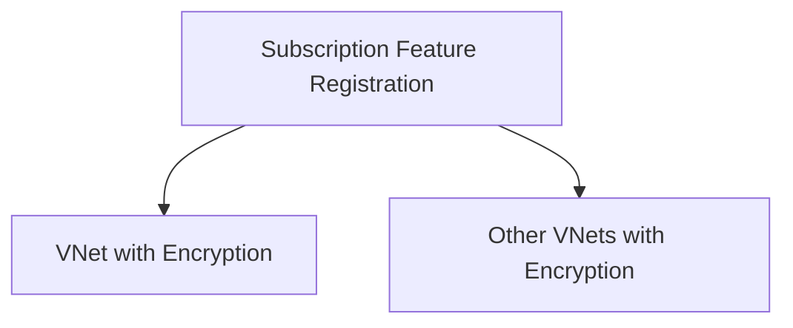

<!-- BEGIN_TF_DOCS -->
<!-- Code generated by terraform-docs. DO NOT EDIT. -->
# VNet Encryption Setup Example

This example demonstrates how to set up Azure VNet encryption as a prerequisite for creating encrypted virtual networks.

## Overview

VNet encryption requires the `AllowDropUnecryptedVnet` feature to be registered in your subscription before you can create VNets with `DropUnencrypted` enforcement. This is a **prerequisite setup** that should be done once per subscription, not as part of the main VNet module.

## Architecture



## Usage

1. **First**: Run this prerequisite setup to register the required Azure feature
2. **Then**: Use the main VNet module with encryption settings in your actual deployments

## Key Points

- This is a **subscription-level** prerequisite, not per-VNet
- Only needed when using `enforcement = "DropUnencrypted"`
- Should be done once and referenced by multiple VNet deployments
- Separates infrastructure prerequisites from business logic

## Files

- `main.tf` - Feature registration resource
- `variables.tf` - Input variables
- `outputs.tf` - Outputs for dependency tracking
- `terraform.tf` - Provider requirements

This approach follows the principle of **separation of concerns** - keeping prerequisite setup separate from the main module functionality.

```hcl
# Get current subscription context
data "azurerm_subscription" "current" {}

# Get a random integer for resource naming
resource "random_integer" "this" {
  max = 9999
  min = 1000
}

# Create resource group
resource "azurerm_resource_group" "this" {
  location = "East US"
  name     = "rg-vnet-encryption-${random_integer.this.result}"
}

# STEP 1: Register Azure subscription feature for VNet encryption with DropUnencrypted enforcement
# This is a prerequisite that must be done once per subscription before creating encrypted VNets
resource "azapi_update_resource" "allow_drop_unencrypted_vnet" {
  resource_id = "/subscriptions/${data.azurerm_subscription.current.subscription_id}/providers/Microsoft.Features/featureProviders/Microsoft.Network/subscriptionFeatureRegistrations/AllowDropUnecryptedVnet"
  type        = "Microsoft.Features/featureProviders/subscriptionFeatureRegistrations@2021-07-01"
  body = {
    properties = {}
  }
}

# STEP 2: Create VNet with encryption enabled (depends on the feature registration)
module "vnet_with_encryption" {
  source = "../.."

  location      = azurerm_resource_group.this.location
  parent_id     = azurerm_resource_group.this.id
  address_space = ["10.0.0.0/16"]
  # Encryption configuration - this requires the feature registration above
  encryption = {
    enabled     = true
    enforcement = "DropUnencrypted" # This requires the AllowDropUnecryptedVnet feature
  }
  # Basic VNet configuration
  name = "vnet-encrypted-${random_integer.this.result}"
  # Example subnets
  subnets = {
    subnet1 = {
      name           = "encrypted-subnet-1"
      address_prefix = "10.0.1.0/24"
    }
    subnet2 = {
      name           = "encrypted-subnet-2"
      address_prefix = "10.0.2.0/24"
    }
  }

  # Ensure the feature is registered before creating the VNet
  depends_on = [azapi_update_resource.allow_drop_unencrypted_vnet]
}
```

<!-- markdownlint-disable MD033 -->
## Requirements

The following requirements are needed by this module:

- <a name="requirement_terraform"></a> [terraform](#requirement\_terraform) (>= 1.9.2)

- <a name="requirement_azapi"></a> [azapi](#requirement\_azapi) (>= 1.13.1, < 3.0.0)

- <a name="requirement_azurerm"></a> [azurerm](#requirement\_azurerm) (>= 3.71.0, < 5.0.0)

- <a name="requirement_random"></a> [random](#requirement\_random) (>= 3.1.0, < 4.0.0)

## Resources

The following resources are used by this module:

- [azapi_update_resource.allow_drop_unencrypted_vnet](https://registry.terraform.io/providers/Azure/azapi/latest/docs/resources/update_resource) (resource)
- [azurerm_resource_group.this](https://registry.terraform.io/providers/hashicorp/azurerm/latest/docs/resources/resource_group) (resource)
- [random_integer.this](https://registry.terraform.io/providers/hashicorp/random/latest/docs/resources/integer) (resource)
- [azurerm_subscription.current](https://registry.terraform.io/providers/hashicorp/azurerm/latest/docs/data-sources/subscription) (data source)

<!-- markdownlint-disable MD013 -->
## Required Inputs

No required inputs.

## Optional Inputs

No optional inputs.

## Outputs

The following outputs are exported:

### <a name="output_encrypted_vnet_id"></a> [encrypted\_vnet\_id](#output\_encrypted\_vnet\_id)

Description: The resource ID of the created encrypted VNet

### <a name="output_encrypted_vnet_name"></a> [encrypted\_vnet\_name](#output\_encrypted\_vnet\_name)

Description: The name of the created encrypted VNet

### <a name="output_encryption_settings"></a> [encryption\_settings](#output\_encryption\_settings)

Description: The encryption settings applied to the VNet

### <a name="output_feature_registration_id"></a> [feature\_registration\_id](#output\_feature\_registration\_id)

Description: The resource ID of the registered feature for VNet encryption

### <a name="output_subscription_id"></a> [subscription\_id](#output\_subscription\_id)

Description: The subscription ID where the feature was registered

## Modules

The following Modules are called:

### <a name="module_vnet_with_encryption"></a> [vnet\_with\_encryption](#module\_vnet\_with\_encryption)

Source: ../..

Version:

<!-- markdownlint-disable-next-line MD041 -->
## Data Collection

The software may collect information about you and your use of the software and send it to Microsoft. Microsoft may use this information to provide services and improve our products and services. You may turn off the telemetry as described in the repository. There are also some features in the software that may enable you and Microsoft to collect data from users of your applications. If you use these features, you must comply with applicable law, including providing appropriate notices to users of your applications together with a copy of Microsoft's privacy statement. Our privacy statement is located at <https://go.microsoft.com/fwlink/?LinkID=824704>. You can learn more about data collection and use in the help documentation and our privacy statement. Your use of the software operates as your consent to these practices.
<!-- END_TF_DOCS -->