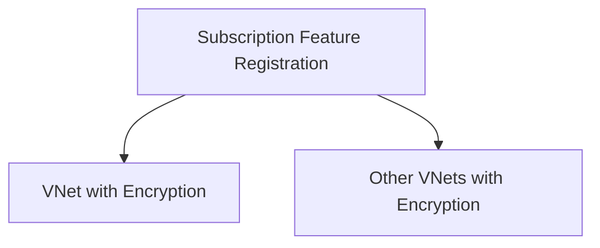

# VNet Encryption Setup Example

This example demonstrates how to set up Azure VNet encryption as a prerequisite for creating encrypted virtual networks.

## Overview

VNet encryption requires the `AllowDropUnecryptedVnet` feature to be registered in your subscription before you can create VNets with `DropUnencrypted` enforcement. This is a **prerequisite setup** that should be done once per subscription, not as part of the main VNet module.

## Architecture

## Usage

1. **First**: Run this prerequisite setup to register the required Azure feature
2. **Then**: Use the main VNet module with encryption settings in your actual deployments

## Key Points

- This is a **subscription-level** prerequisite, not per-VNet
- Only needed when using `enforcement = "DropUnencrypted"`
- Should be done once and referenced by multiple VNet deployments
- Separates infrastructure prerequisites from business logic

## Files

- `main.tf` - Feature registration resource
- `variables.tf` - Input variables
- `outputs.tf` - Outputs for dependency tracking
- `terraform.tf` - Provider requirements

This approach follows the principle of **separation of concerns** - keeping prerequisite setup separate from the main module functionality.
